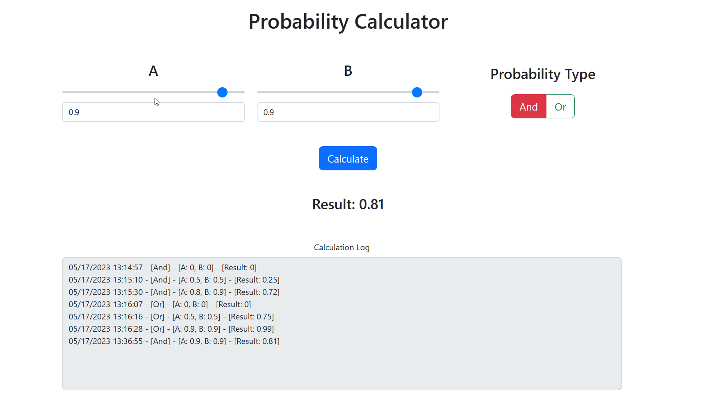

# probability 

Simple React client app and a minimal .NET API using MediatR and FluentValidation + back-end API tests around validation and MediatR handler.

# Client app

## Points of interest

All logic is in the `Main.js` file. Proxy is set in the `package.json` with the same port that the back-end API runs on.

# API

I've put everything in a single project in the interest of saving time. I also haven't added Swagger or anything else too fancy. Usually I'll have different projects for different layers like services, infrastructure, domain etc.

Since I've used minimal API the controllers are inside `Program.cs`. Throughout the code I've added comments explaining my reasoning.

The `log.txt` will be written in the root of the API project.
